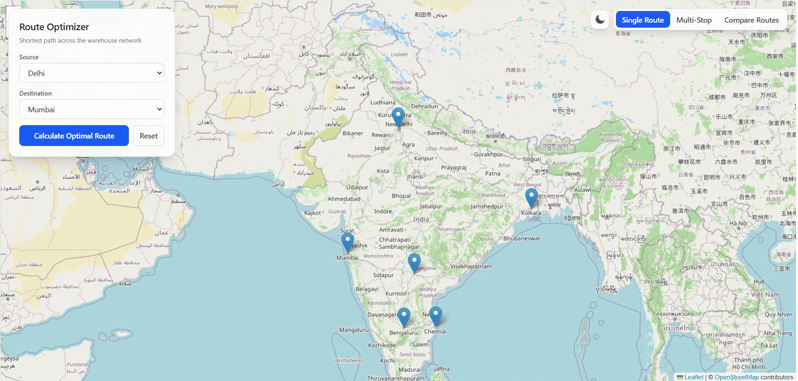

# 🚚 Logistics Route Optimizer

**An interactive, full-stack route optimization visualizer** for logistics networks — built with real road-network routing, multiple pathfinding algorithms, and a live MERN backend.

Plan optimal delivery routes across a network of Indian warehouses, compare alternate paths, optimize multi-stop delivery orders, and watch it all animate on a live map with real road geometry — not just straight lines between cities.

🔗 **[Live Demo](https://logistics-route-optimizer.netlify.app)**

> **Note:** The backend is hosted on Render's free tier, which spins down after periods of inactivity. The **first** request after idle time may take 30–60 seconds to wake the server back up — this is expected, not a bug. Every request after that is fast.

---

## ✨ Features

### 🗺️ Real Road-Network Routing
Routes aren't straight lines between coordinates — every path is fetched from **OSRM (Open Source Routing Machine)**, giving real road distances, real driving durations, and real curved road geometry rendered on the map.

### ⚡ Single Route Optimization
Pick any two warehouses and instantly compute the shortest path using **Dijkstra's Algorithm**, complete with total distance and estimated travel time.

### 📦 Multi-Stop Delivery Optimization
Select a starting warehouse and multiple delivery stops — the app solves for the **optimal visiting order** (an open-path TSP solved via permutation search), minimizing total distance across the entire route.

### 🔀 Route Comparison Mode
See the **top 2 alternate paths** between any two points side by side, powered by **Yen's k-shortest-paths algorithm** — useful for understanding trade-offs, not just the single "best" answer.

### 🚚 Animated Vehicle Tracking
A vehicle icon glides smoothly along the calculated route in real time, interpolated across the actual road geometry.

### 🌗 Dark Mode
Full dark theme support, including dynamically swapped dark map tiles.

### 🌐 Full MERN Stack
- **MongoDB Atlas** — cloud-hosted graph data (warehouses & routes)
- **Express.js** — REST API serving pathfinding results computed server-side
- **React (Vite)** — fast, modern frontend
- **Node.js** — backend runtime

---

## 🧠 Algorithms Under the Hood

| Algorithm | Purpose |
|---|---|
| **Dijkstra's Algorithm** | Shortest single path between two warehouses |
| **Yen's Algorithm** | Top-k shortest loopless paths, for route comparison |
| **Permutation-based TSP solver** | Optimal visiting order for multi-stop deliveries |

All routing logic is implemented in pure, framework-agnostic JavaScript (`routingUtils.js`), decoupled from both the UI and the database layer — the same core algorithm code runs unmodified on both the client and the Express server.

---

## 🛠️ Tech Stack

**Frontend**
- React (Vite)
- Tailwind CSS
- react-leaflet / Leaflet.js
- OSRM API (road routing & geometry)

**Backend**
- Node.js + Express
- MongoDB Atlas + Mongoose

---

## 🚀 Getting Started

### Prerequisites
- Node.js (v18+)
- A MongoDB Atlas connection string (free tier works)

### 1. Clone the repository
```bash
git clone https://github.com/Ansh-san/logistics-route-optimizer.git
cd logistics-route-optimizer
```

### 2. Set up the backend
```bash
cd server
npm install
```

Create a `.env` file in `server/`:
```env
MONGODB_URI=your_mongodb_atlas_connection_string
PORT=5000
```

Seed the database:
```bash
npm run seed
```

Start the server:
```bash
npm run dev
```

### 3. Set up the frontend
```bash
cd ../logistics-visualizer
npm install
npm run dev
```

Open **http://localhost:5173** in your browser.

---

## 📸 Preview



---

## 🗺️ Warehouse Network

The demo dataset includes 6 major Indian logistics hubs:

**Delhi · Mumbai · Bengaluru · Kolkata · Hyderabad · Chennai**

Each is connected by realistic road routes, enriched at runtime with live OSRM data.

---

## 📁 Project Structure

```
logistics-route-optimizer/
├── logistics-visualizer/     # React (Vite) frontend
│   └── src/
│       ├── components/       # Map, control panels, comparison UI
│       ├── utils/             # Dijkstra, Yen's algorithm, TSP solver, OSRM service
│       └── data/               # Static warehouse graph (dev fallback)
└── server/                    # Express + MongoDB backend
    ├── controllers/
    ├── models/
    ├── routes/
    └── utils/                  # Server-side routing logic (mirrors frontend)
```

---

## 🎯 Why This Project

This project was built to explore how classic graph algorithms — Dijkstra's and Yen's — translate into real, usable logistics tooling. It's designed to be **modular and production-shaped**, with algorithmic logic fully isolated from the UI and database layers, making it straightforward to extend to larger networks, additional constraints (vehicle capacity, time windows), or a production routing provider.

---

## 📄 License

This project is open source and available under the [MIT License](LICENSE).

---

<p align="center">Built by <a href="https://github.com/Ansh-san">Ansh-san</a></p>
